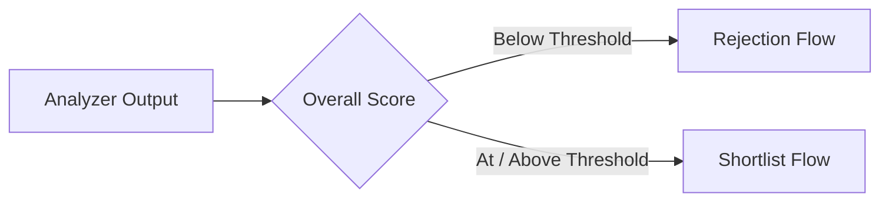
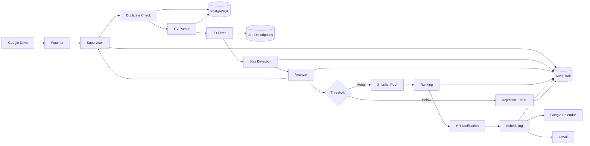
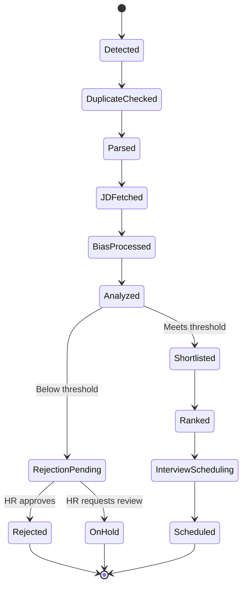
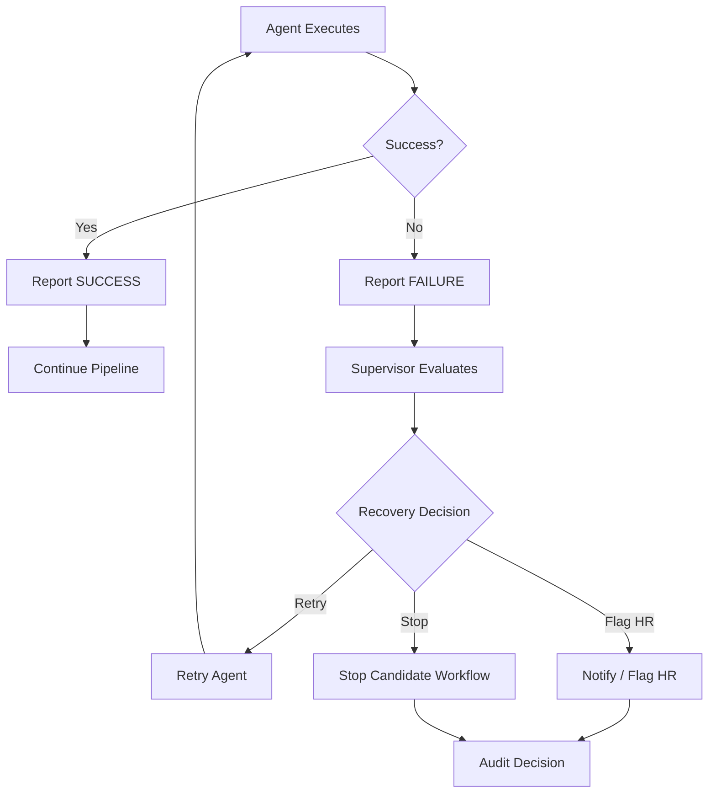

# Multi-Agent Hiring Pipeline
## Technical Workflow & System Specification

> **Product name:** HireLoop  
> **Document Type:** System Workflow Specification  
> **Status:** in-process  
> **Architecture:** Event-driven, multi-agent hiring automation  
> **Primary Integrations:** Google Drive, Gmail, Google Calendar, PostgreSQL  
> **Human Oversight:** Human-in-the-Loop (HITL) at rejection & approval decisions

---

## 1. Executive Overview

The **Multi-Agent Hiring Pipeline** is an event-driven recruitment automation system in which specialized agents collaborate under a continuously running **Supervisor Agent**.

The system begins with a one-time HR configuration and then continuously monitors Google Drive for newly uploaded CVs. Each candidate moves through a controlled sequence of validation, parsing, job-description matching, bias reduction, scoring, ranking, HR notification, and scheduling.

The **Supervisor Agent** acts as the orchestration and governance layer. Every downstream agent reports a success or failure state to the Supervisor, which decides whether to continue, retry, flag the issue for HR, or stop the affected candidate workflow.

### Core Design Principles

- **Agent specialization:** Each agent performs one clearly defined responsibility.
- **Supervisor governance:** The Supervisor coordinates and validates every stage.
- **Event-driven processing:** New CV uploads trigger candidate processing automatically.
- **Human-in-the-loop:** HR retains control over rejection decisions requiring human judgment.
- **Auditability:** Agent actions, decisions, scores, failures, and HR decisions are recorded.
- **Data integrity:** Original candidate information remains preserved in PostgreSQL.
- **Bias reduction:** Sensitive signals are removed from the scoring representation where possible.
- **Candidate-level lifecycle:** A candidate workflow ends when the candidate is scheduled, rejected, or placed on hold.

---

# 2. End-to-End Workflow

```mermaid
flowchart TD
    START([System Start])

    SETUP["HR SETUP<br/>One-Time Configuration<br/><br/>
    • Add JD(s) → PostgreSQL<br/>
    • Create Google Drive role folders<br/>
    • Connect HR Gmail / Calendar<br/>
    • Configure scoring preferences"]

    SUP["SUPERVISOR AGENT<br/>Always Running<br/><br/>
    • Orchestrates pipeline<br/>
    • Tracks agent status<br/>
    • Handles retry / flag / stop<br/>
    • Writes audit decisions"]

    WATCH["STEP 1 — WATCHER AGENT<br/><br/>
    Google Drive Webhook<br/>
    Detect new CV<br/>
    Resolve Job Role<br/>
    Pass CV path + Job Role"]

    DUP["STEP 2 — DUPLICATE CHECK AGENT<br/><br/>
    Check candidate name + email<br/>
    Duplicate → replace old record<br/>
    New → continue"]

    PARSER["STEP 3 — CV PARSER AGENT<br/><br/>
    Read PDF / DOCX<br/>
    Extract candidate data<br/>
    Store structured data"]

    JD["STEP 4 — JD FETCH AGENT<br/><br/>
    Read job_role<br/>
    Fetch matching JD<br/>
    Combine JD + CV"]

    BIAS["STEP 5 — BIAS DETECTION AGENT<br/><br/>
    Detect bias signals<br/>
    Create clean scoring version<br/>
    Preserve original data"]

    ANALYZER["STEP 6 — ANALYZER AGENT<br/><br/>
    Senior-role evaluation<br/>
    Section scoring 0–10<br/>
    Overall score + reasoning"]

    DECISION{"Score ≥ Threshold?"}

    REJECT["REJECTION FLOW<br/><br/>
    Prepare HR rejection report<br/>
    Prepare candidate rejection email<br/>
    HITL review"]

    HITL{"HR Decision"}

    SEND_REJECT["Send rejection email<br/>Log final decision"]

    HOLD["Candidate on Hold<br/>HR reviews in dashboard<br/>Final HR decision logged"]

    SHORT["SHORTLIST FLOW<br/><br/>
    Add candidate to shortlist pool"]

    RANK["STEP 7 — RANKING AGENT<br/><br/>
    Compare shortlisted candidates<br/>
    Highlight Top 3<br/>
    Report to Supervisor"]

    HRMAIL["HR NOTIFICATION<br/><br/>
    • Candidates + rankings<br/>
    • Section scores<br/>
    • Candidate reasoning<br/>
    • Interview questions"]

    SCHED["STEP 8 — SCHEDULING AGENT<br/><br/>
    Suggest working days<br/>
    HR selects slot<br/>
    Book HR Calendar<br/>
    Send confirmation"]

    COMPLETE([Pipeline Complete])

    START --> SETUP --> SUP
    SUP --> WATCH
    WATCH --> DUP --> PARSER --> JD --> BIAS --> ANALYZER --> DECISION

    DECISION -- "No" --> REJECT --> HITL
    HITL -- "Approve Rejection" --> SEND_REJECT --> AUDIT1[(Audit Log Updated)]
    HITL -- "Review Manually" --> HOLD --> AUDIT2[(Audit Log Updated)]

    DECISION -- "Yes" --> SHORT --> RANK --> HRMAIL --> SCHED --> COMPLETE
    SCHED --> AUDIT3[(Audit Log Updated)]
```



---

# 3. System Lifecycle

The system operates across three different lifecycle levels.

| Lifecycle | Trigger | Duration | End Condition |
|---|---|---|---|
| **HR Setup** | HR configures the system | One time | Configuration completed |
| **System Runtime** | HR activates the system | Continuous | HR manually deactivates system |
| **Candidate Workflow** | New CV uploaded | Per candidate | Scheduled, rejected, or placed on hold |

### Important Boundary

The **Supervisor Agent** and **Watcher Agent** are persistent services. They do not stop after processing one candidate.

Individual candidate workflows, however, are finite.

---

# 4. HR Setup — One-Time Configuration

Before candidate processing begins, HR completes the initial system configuration.

### Responsibilities

1. Add one or more Job Descriptions (JDs).
2. Store JDs in the `job_descriptions` PostgreSQL table.
3. Create corresponding job-role folders in Google Drive.
4. Connect the HR Gmail account.
5. Connect the HR Google Calendar.
6. Configure scoring preferences and thresholds.

### Setup Output

The system should have:

- Valid job descriptions.
- A known Google Drive folder for each role.
- Valid Gmail integration.
- Valid Calendar integration.
- Configured scoring rules / threshold.

After setup is complete, the runtime pipeline can remain active continuously.

---

# 5. Supervisor Agent

The **Supervisor Agent** is the central orchestration and governance component.

## Primary Responsibilities

- Oversee the entire hiring pipeline.
- Track the state of every agent.
- Receive `SUCCESS` / `FAILURE` reports from agents.
- Decide whether a failed operation should:
  - Retry.
  - Be flagged for HR.
  - Stop the affected candidate workflow.
- Record important decisions in the audit trail.
- Control candidate progression between stages.
- Pause the pipeline when HR approval is required.

## Agent Status Model

Each agent should report a clear execution status.

```text
PENDING
   ↓
RUNNING
   ↓
SUCCESS ───────────────→ NEXT STEP

RUNNING
   ↓
FAILURE
   ├──→ RETRY
   ├──→ FLAG FOR HR
   └──→ STOP CANDIDATE WORKFLOW
```

The exact retry policy can be configured separately.

---

# 6. Step 1 — Watcher Agent

The Watcher Agent is the entry point for candidate processing.

## Responsibilities

- Listen to Google Drive using a webhook/event mechanism.
- Detect newly uploaded CVs.
- Determine the job role from the Google Drive folder.
- Capture the CV file path.
- Send the candidate event to the Supervisor.

## Input

```text
Google Drive CV Upload Event
```

## Output

```text
CV File Path
+
Job Role
+
Drive Metadata
```

## Success Condition

A valid new CV is detected and the corresponding job role can be resolved.

## Failure Condition

The event cannot be processed, the file is inaccessible, or the job role cannot be resolved.

---

# 7. Step 2 — Duplicate Check Agent

The Duplicate Check Agent prevents multiple active records for the same candidate.

## Matching Strategy

The initial duplicate lookup uses:

- Candidate name
- Candidate email

## Duplicate Found

When an existing candidate is found:

1. Identify the existing candidate/application record.
2. Delete or replace the old record according to the configured data policy.
3. Insert the latest CV data.
4. Continue the pipeline.

## No Duplicate

If no matching candidate exists:

1. Create the new candidate/application record.
2. Continue the pipeline.

## Output

```text
Candidate Record
+
Latest CV Reference
+
Job Role
```

The operation result is reported to the Supervisor.

---

# 8. Step 3 — CV Parser Agent

The CV Parser Agent converts an uploaded CV into structured candidate information.

## Supported Input

- PDF
- DOCX

## Extracted Information

| Category | Example Data |
|---|---|
| Identity | Name, email |
| Skills | Technical and professional skills |
| Experience | Roles, companies, duration, responsibilities |
| Education | Degrees, institutions, qualifications |
| Projects | Project names, descriptions, technologies |
| Certifications | Certification names and relevant details |

## Storage

Structured candidate information is stored in PostgreSQL.

The candidate's `job_role` is stored in the `applications` table so downstream agents can identify the intended role.

---

# 9. Step 4 — JD Fetch Agent

The JD Fetch Agent connects the candidate to the correct Job Description.

## Process

```text
applications.job_role
        ↓
job_descriptions.job_role
        ↓
Matching Job Description
        ↓
JD + Structured CV Data
```

## Responsibilities

- Read `job_role` from the candidate application.
- Query the `job_descriptions` table.
- Retrieve the matching JD.
- Provide the JD and candidate CV data to the next stage.

## Success Condition

A valid JD exists for the candidate's job role.

## Failure Condition

No matching JD can be found or the JD cannot be retrieved.

---

# 10. Step 5 — Bias Detection Agent

The Bias Detection Agent creates a temporary representation of the candidate for scoring.

## Bias Signals to Review

The system should identify and reduce the influence of signals such as:

- Gender
- Age
- University name
- Location

> **Important:** Bias reduction does not guarantee complete elimination of bias. The system should explicitly treat the output as a mitigation mechanism rather than a guarantee of unbiased hiring.

## Data Handling Principle

```text
Original Candidate Data
        │
        ├──────────────→ PostgreSQL
        │                 PRESERVED
        │
        └──────────────→ Bias Detection
                            │
                            ↓
                    Clean Temporary CV
                            │
                            ↓
                       Scoring Only
```

The original candidate information remains untouched in PostgreSQL.

The bias report is recorded in the audit trail.

---

# 11. Step 6 — Analyzer Agent

The Analyzer Agent acts as the **Senior Expert** for the matched job role.

It receives:

- Clean CV representation
- Matched Job Description
- Configured scoring preferences

## Evaluation Dimensions

Each category is scored from **0 to 10**.

| Category | Score |
|---|---:|
| Skills Match | 0–10 |
| Experience Quality | 0–10 |
| Project Relevance | 0–10 |
| Education Fit | 0–10 |
| Communication | 0–10 |

## Analyzer Output

The Analyzer produces:

1. Section-level scores.
2. Overall candidate score.
3. Detailed reasoning.
4. Strengths.
5. Relevant gaps.
6. Audit information.

### Conceptual Scoring Model

```text
Skills Match        → 0–10
Experience Quality  → 0–10
Project Relevance   → 0–10
Education Fit       → 0–10
Communication       → 0–10
                      │
                      ↓
              Overall Score
                      │
                      ↓
             Threshold Decision
```

The actual weighting can be controlled through the HR scoring configuration.

---

# 12. Decision Gateway

After analysis, the Supervisor evaluates the candidate against the configured threshold.



---

# 13. Rejection Flow

Candidates whose score falls below the configured threshold enter the rejection workflow.

## Supervisor Preparation

The Supervisor prepares:

### HR Rejection Report

Contains:

- Candidate identification/reference.
- Section scores.
- Overall score.
- Main reasons for rejection.
- Relevant evaluation reasoning.

### Candidate Rejection Email

The system prepares a professional and respectful rejection email.

The email is **not immediately sent**. It first enters the HITL approval step.

---

# 14. Human-in-the-Loop Rejection Check

The Supervisor pauses the candidate workflow and asks HR:

> **Approve rejection or review manually?**

## Decision A — HR Approves Rejection

```text
HR Approval
    ↓
Rejection Email Sent
    ↓
Supervisor Logs Decision
    ↓
Audit Log Updated
    ↓
Candidate Workflow Ends
```

## Decision B — HR Requests Manual Review

```text
HR Manual Review
    ↓
Candidate Placed On Hold
    ↓
Candidate Appears in HR Dashboard
    ↓
HR Makes Final Decision
    ↓
Supervisor Logs Decision
    ↓
Audit Log Updated
```

The candidate remains outside the automated progression until HR completes the manual review.

---

# 15. Shortlist Flow

Candidates meeting or exceeding the configured threshold are added to the shortlist pool in PostgreSQL.

```text
Score ≥ Threshold
        ↓
Shortlist Candidate
        ↓
PostgreSQL Shortlist Pool
        ↓
Ranking Agent
```

The shortlist is therefore the input dataset for comparative ranking.

---

# 16. Step 7 — Ranking Agent

The Ranking Agent compares shortlisted candidates **against each other**, rather than evaluating each candidate in isolation.

## Responsibilities

- Retrieve shortlisted candidates.
- Compare candidates for the relevant job role.
- Rank candidates.
- Highlight the top three candidates.
- Provide ranking results to the Supervisor.

## Output

```text
Rank 1 → Candidate A
Rank 2 → Candidate B
Rank 3 → Candidate C
...
```

The ranking result is reported to the Supervisor and recorded for auditability.

---

# 17. HR Notification

After ranking, the system prepares an HR notification containing the information needed for interview decisions.

## Notification Contents

### Candidate Information

- Shortlisted candidates.
- Ranking position.
- Candidate reference.

### Evaluation

- Section scores.
- Overall scores.
- Reasoning for each candidate.

### Interview Preparation

The system generates interview questions based on:

- Candidate CV gaps.
- Candidate strengths.
- Job Description requirements.
- Areas requiring validation during the interview.

The notification is delivered to HR through the configured HR communication channel.

---

# 18. Step 8 — Scheduling Agent

The Scheduling Agent handles interview scheduling after HR has identified the appropriate candidate(s).

## Workflow

```text
Available Working Days
        ↓
Scheduling Agent Suggests Options
        ↓
HR Selects Slot
        ↓
Google Calendar Booking
        ↓
Confirmation Email
        ↓
Audit Log Updated
        ↓
Candidate Workflow Complete
```

## Responsibilities

- Suggest available working days.
- Present scheduling options to HR.
- Receive HR's selected slot.
- Book the interview in HR's Google Calendar.
- Send confirmation email.
- Report success or failure to the Supervisor.

---

# 19. Audit Trail

Auditability is a core system requirement.

The system should record important actions and decisions throughout the candidate lifecycle.

## Recommended Audit Events

| Event | Example |
|---|---|
| Candidate detected | New CV uploaded |
| Duplicate check | Duplicate found / not found |
| CV parsed | Parser completed |
| JD fetched | JD matched to role |
| Bias analysis | Bias report generated |
| Candidate analyzed | Scores generated |
| Threshold decision | Shortlist / rejection |
| HR decision | Approved / manual review |
| Ranking | Candidate ranked |
| Notification | HR notification generated/sent |
| Scheduling | Calendar event created |
| Pipeline completion | Candidate workflow ended |
| Agent failure | Error + Supervisor decision |
| Retry | Retry attempt + result |

### Audit Principle

Every important automated decision should have enough information to answer:

> **What happened, when did it happen, which agent performed it, what was the result, and what did the Supervisor decide?**

---

# 20. Data Flow



---

# 21. Core System Components

| Component | Responsibility | Runtime |
|---|---|---|
| **Supervisor Agent** | Orchestration, governance, error handling | Always running |
| **Watcher Agent** | Detect new CV uploads | Always running |
| **Duplicate Check Agent** | Detect and replace duplicate candidate records | Per candidate |
| **CV Parser Agent** | Extract structured CV information | Per candidate |
| **JD Fetch Agent** | Retrieve matching JD | Per candidate |
| **Bias Detection Agent** | Produce clean scoring representation | Per candidate |
| **Analyzer Agent** | Evaluate candidate against JD | Per candidate |
| **Ranking Agent** | Compare shortlisted candidates | Shortlist cycle |
| **Scheduling Agent** | Coordinate interview booking | Per scheduled candidate |

---

# 22. External Integrations

| Integration | Purpose |
|---|---|
| **Google Drive** | CV storage, job-role folders, upload events |
| **PostgreSQL** | JDs, applications, candidate data, shortlist data, audit records |
| **Gmail** | HR notifications, rejection emails, scheduling confirmations |
| **Google Calendar** | Interview availability and booking |

---

# 23. Candidate State Model

A candidate should have a clear lifecycle state.



---

# 24. Failure & Recovery Model

Failures are handled by the Supervisor rather than independently terminating the entire system.



### Important Principle

A failure affecting one candidate should **not automatically stop the entire hiring system**.

The Supervisor should isolate candidate-level failures whenever possible.

---

# 25. System Boundaries

## System Starts

The candidate-processing system becomes operational when:

1. HR has completed the required one-time setup.
2. The system is active.
3. A CV is uploaded to a monitored Google Drive folder.

## System Never Stops

The following services operate continuously while the system is active:

- Supervisor Agent
- Watcher Agent

## Candidate Workflow Stops

A candidate workflow ends when one of the following occurs:

- Interview/calendar booking is completed.
- Rejection email is sent.
- Candidate is placed on hold for HR review.

## Full System Stop

The entire system stops **only when HR manually deactivates the system**.

---

# 26. Complete Candidate Journey

```text
HR SETUP
   │
   ▼
SYSTEM ACTIVE
   │
   ▼
CV UPLOADED TO GOOGLE DRIVE
   │
   ▼
WATCHER
   │
   ▼
DUPLICATE CHECK
   │
   ▼
CV PARSER
   │
   ▼
JD FETCH
   │
   ▼
BIAS DETECTION
   │
   ▼
ANALYZER
   │
   ▼
THRESHOLD DECISION
   │
   ├───────────────────────────────┐
   │                               │
   ▼                               ▼
BELOW THRESHOLD              MEETS THRESHOLD
   │                               │
   ▼                               ▼
REJECTION FLOW                SHORTLIST
   │                               │
   ▼                               ▼
HITL HR CHECK                    RANKING
   │                               │
   ├───────────────┐               ▼
   │               │         HR NOTIFICATION
   ▼               ▼               │
APPROVE         MANUAL REVIEW      ▼
   │               │          SCHEDULING
   ▼               ▼               │
REJECTED        ON HOLD            ▼
                              CALENDAR BOOKED
                                    │
                                    ▼
                              PIPELINE COMPLETE
```

---

# 27. Design Principles & Governance

### 27.1 Supervisor-First Architecture

No downstream agent should silently determine the final pipeline state. Agents report their execution result to the Supervisor, which controls progression.

### 27.2 Human Authority

Automation supports HR decision-making but does not replace HR authority for sensitive decisions, particularly rejection/manual-review decisions.

### 27.3 Original Data Preservation

Bias mitigation must not overwrite the original candidate information. The clean representation is a temporary scoring artifact.

### 27.4 Auditability by Default

Agent execution, decisions, failures, retries, and HR interventions should be traceable.

### 27.5 Candidate Isolation

A failure for Candidate A should not unnecessarily block Candidate B.

### 27.6 Configurable Scoring

Scoring thresholds and weighting should be configurable rather than hard-coded.

### 27.7 Explicit Completion States

Every candidate should eventually reach a known terminal state:

- `REJECTED`
- `ON_HOLD`
- `SCHEDULED`

---

# 28. Final Architecture Summary

The proposed system can be summarized as:

```text
                    ┌───────────────────────┐
                    │      HR / ADMIN       │
                    │  Setup + Decisions    │
                    └───────────┬───────────┘
                                │
                                ▼
                    ┌───────────────────────┐
                    │   SUPERVISOR AGENT    │
                    │ Orchestration + Audit │
                    └───────────┬───────────┘
                                │
        ┌───────────────────────┼────────────────────────┐
        │                       │                        │
        ▼                       ▼                        ▼
   WATCHER                  ANALYSIS                DECISION
        │                       │                        │
        ▼                       ▼                 ┌──────┴──────┐
   CV PROCESSING          BIAS + SCORING          │             │
        │                                         ▼             ▼
        ▼                                     REJECTION      SHORTLIST
   JD MATCHING                                      │             │
        │                                           ▼             ▼
        └─────────────────────────────────────── HITL         RANKING
                                                              │
                                                              ▼
                                                         HR NOTIFY
                                                              │
                                                              ▼
                                                         SCHEDULING
                                                              │
                                                              ▼
                                                        CALENDAR BOOKED
```

---

# 29. End State

The Multi-Agent Hiring Pipeline provides a controlled recruitment workflow in which:

**Google Drive event → Candidate validation → CV parsing → JD matching → Bias mitigation → Expert analysis → Threshold decision → HR-controlled rejection or shortlist → Ranking → HR notification → Interview scheduling → Audit completion**

The system remains continuously operational until HR explicitly deactivates it, while each candidate follows an independently managed lifecycle under Supervisor Agent control.

---

## Document Status

| Attribute | Value |
|---|---|
| Document | Multi-Agent Hiring Pipeline — Complete Workflow |
| Version | 1.0 |
| Status | Proposed |
| Architecture | Multi-Agent / Event-Driven |
| Human Oversight | Required |
| Primary Database | PostgreSQL |
| File Storage | Google Drive |
| Communication | Gmail |
| Scheduling | Google Calendar |
| Orchestration | Supervisor Agent |
